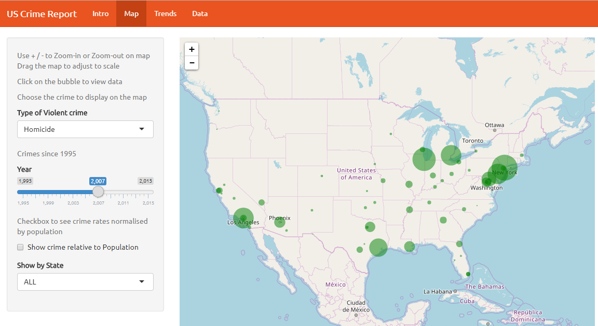
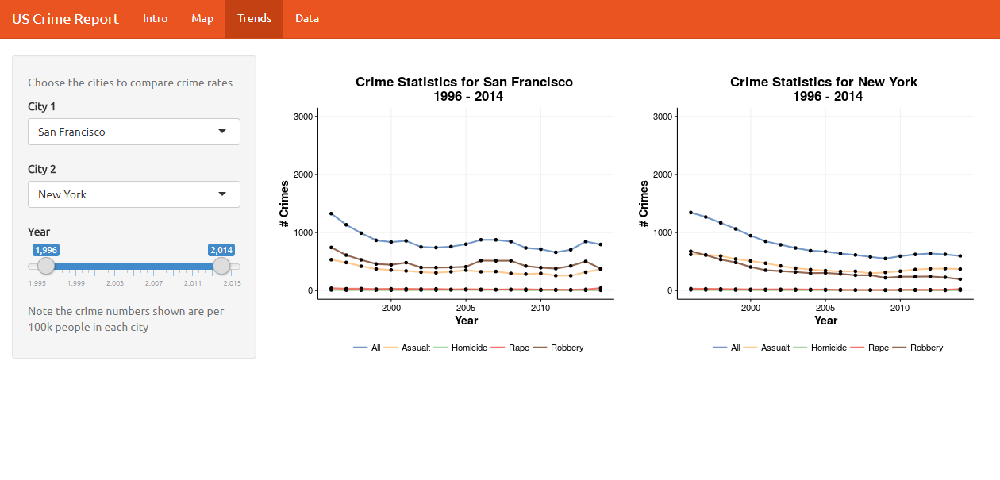
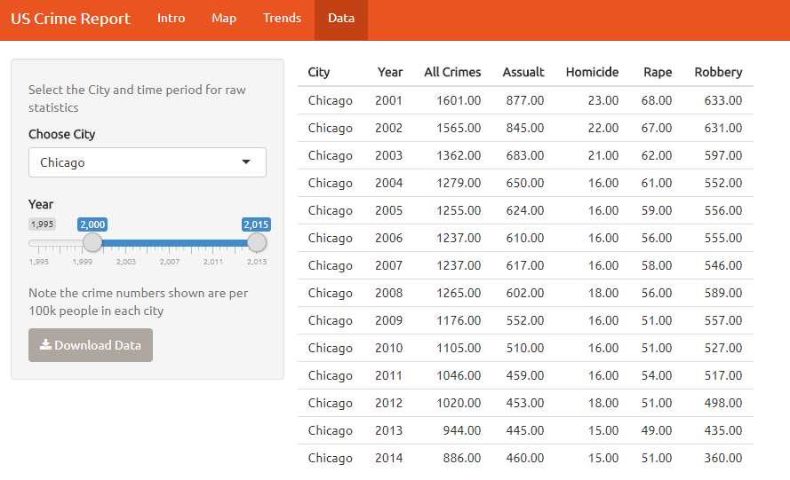

# US Violent Crime Report based on Marshall data

Shiny App for violent crime analysis in US

|Links|
| ------------------------------- |
| [Deployed Shiny App](https://akshi8.shinyapps.io/US_Crime_Report/)         |
| [Rendered Milestone Writeup](https://github.com/akshi8/US_Crime_Report/blob/master/milestone2.md) |
| [Shiny App Source Code](https://github.com/akshi8/US_Crime_Report/blob/master/code/app.R)      |

#### Changed goals
* How have your visualization goals changed?

  - After some valuable feedback and insights from @Tamara_Munzner and Samuel Hinshaw (@hinshaws) on my initial milestone goals, I decided to re-design my app and changed it's end-user.

  - Previously the `US Crime Data App` was meant for a police commissioner of a particular city and visualization had less context and usability, I have tried to simply for this milestone to get the app up and running first.

#### Refined App goals

- The App is meant for any official of `Department of Homeland Security` or any `Federal criminal jurisdiction` who wants to quickly understand **Where are the crimes concentrated?** , **Which cities have shown increase over decrease in crime rates?** between 1995-2015

- Apart from overall view of concentration of crimes across the US, the city-wise crime comparison is important to get an insight into **how are the cities are performing against each other?**

- The reason an official will be particularly interested in a city-level comparison is to understand how are the particular jurisdiction performing against each other and which cities need better judicial infrastructure and stronger law and order enforcement

- In short, the `US Crime Report` app provides a quick-view for concentrated and crime trends in the US based on the year and city (jurisdiction).

###### Does your app enable the tasks you set out to facilitate?

* For this milestone I have prioritized the development of the App with the above goals in mind
* I will be addressing the `gaps` in the app later, also right now the usability is very basic and aesthetics are minimal

#### About the app

* `Intro` provides a summary of app layout, navigation and usability.

  - So before making any assumptions, the user can understand the layout and what information is being conveyed

  - Carries information about navigation and how the marshall crime project come About

  - Additionally carries app developer's info and contact if a user you like to interact or suggest improvements

- A high-level overview of what each `tab` represent

  * `Map`:
    - Visualises the number of crimes between 1995-2015 by selecting the crime type based on the geographic concentration of crimes. The added feature of `Show crime relative to Population` normalizes the crime numbers by the population of the city

   - The instructions about zooming and viewing data labels using tooltips are included

   -  Since it is a leaflet map, and not the most sophisticated of using map tools the user can find little problem initially to adjust the view and aspect relationship

   - WIP features: Instead of showing raw crime numbers for a city and all in `green` I will be implementing a `colour scale` of increase or decrease in crime since past 5 years, the colour scale will be red, yellow, green on a gradient scale based on increase in decrease in crimes

  * `Trends`: Shows the trend of all crimes between two cities based on the user selection of time period and cities

    - The trends currently show pretty straightforward line chart of various cities
    - WIP feature: I will try to include a `prediction` or `forecast` for years after 2015, that is 2016-2018
    - Also, the aspect ratio of charts are not really good and there is no tool-tip, which I will add in next milestone

  * `Data`: Based on year and city selection user can download data as a csv

    - Addition: I will give the user to select all or multiple cities to download data

Who made it?
This app was created by [Akshi Chaudhary](https://github.com/akshi8), masters student of data science at UBC

If you'd like to get in touch; talk about this app, contribute to it, or make a suggestion for new features, contact via twitter [@ChaudharyAkshi](https://twitter.com/ChaudharyAkshi) or on github [akshi8](https://github.com/akshi8/US_Crime_Report)

