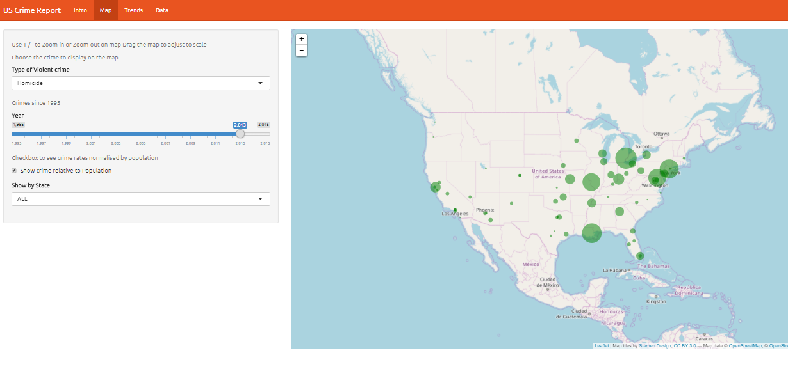
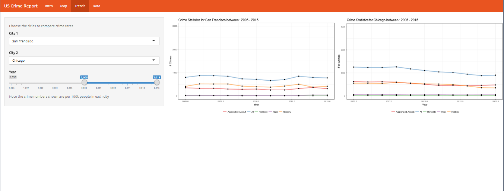
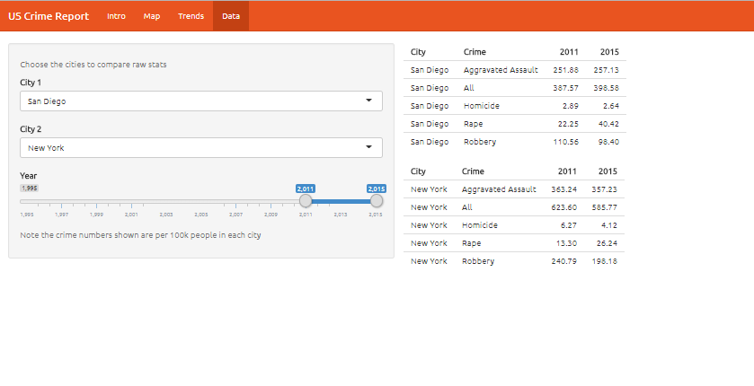

# Week 3 - Project Milestone 2: First submission

#### Change goals
* How have your visualization goals changed?

- After some valuable feedback and insights from @Tamara_Munzner and Samuel Hinshaw (@hinshaws) on my initial milestone goals, I decided to re-design my app and changed it's end-user.

- Previously the `US Crime Data App` was meant for a police commisioner of a particular city and visulaization had less context and usuability, I have tried to simply for this milestone to get the app up and running first.

#### Refined App goals

- The App is meant for any official of `Department of Homeland Security` or any `Federal criminal jurisdiction` who wants to quickly understand **Where are the crimes concentrated?** , **Which cities have shown increase over decrease in crime rates?** between 1995-2015

- Apart from overall view of concentration of crimes across US, the city-wise crime comparison is important to get an insight about **how are the cities are performing against each other?**

- The reason an official will be particularly interested in a city-level comparison is to understand how are the particular jurisdiction performing against each other and which cities need better judicial infrastructure and stronger law and order enforcement

- In short, the `US Crime Report` app provides a quick-view for concentrated and crime trends in the US based on the year and city (jurisdiction).

###### Does your app enable the tasks you set out to facilitate?

* For this milestone I have prioritized the development of the App with the above goals in mind
* I will be addressing the `gaps` in the app later, also right now the usuability is very basic and aethestics are minimal

#### About the app

* `Intro` provides a summary of app layout, navigation and usuability.

  - So before making any assumptions, the user can understand the layout and what information is being conveyed

- A high level overview of what each `tab` represent

  * `Map`: Visualises the number of crimes between 1995-2015 by selecting the crime type based on geographic concentration of crimes. The added feature of `Show crime relative to Population` normalizes the crime numbers by the population of the city

  * `Trends`: Shows the trend of all crimes between two cities based on the user selection of time period and cities

  * `Data`: Compares the crime rates between two cities through raw statistics and user selections

